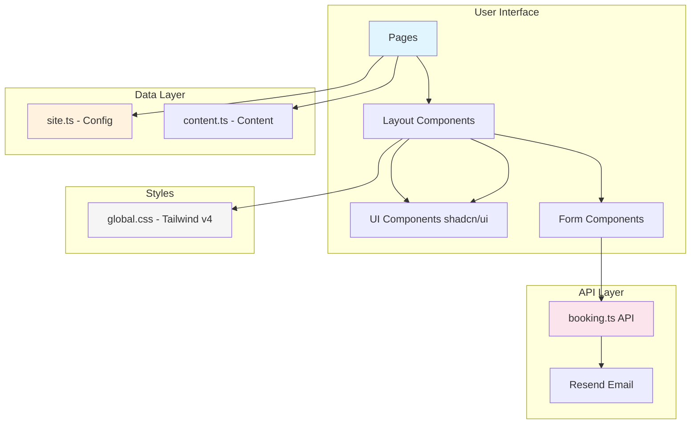
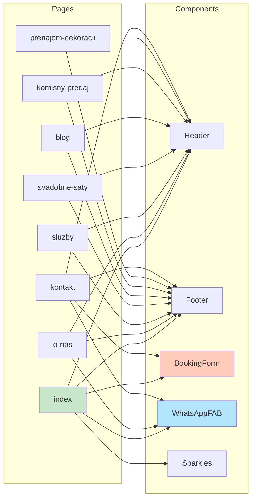

# MagicRoom Architecture Documentation

## Overview

MagicRoom is a wedding salon website built with **Astro 6.x**, serving as an online presence for a bridal boutique in Martin, Slovakia. The site combines static pages for content with server-side rendering (SSR) for the booking API. It features a personal, boutique-style experience with transparent pricing and a direct booking workflow.

### Tech Stack

| Layer | Technology |
|-------|------------|
| Framework | Astro 6.x (static + SSR for API) |
| Styling | Tailwind CSS v4 |
| UI Components | shadcn/ui + React |
| Icons | lucide-react |
| Email Service | Resend API |
| Hosting | Vercel |
| Language | TypeScript |

### Codebase Stats

- **Files:** 64
- **Nodes:** 474 (symbols)
- **Edges:** 504 (relationships)
- **Communities:** 4 functional areas

---

## Functional Areas

### 1. Pages (`src/pages/`)

Static Astro pages that form the public website:

| Page | Purpose |
|------|---------|
| `index.astro` | Homepage — hero, services, trust reasons, founder story, booking |
| `o-nas.astro` | About — Natália's story, salon philosophy |
| `sluzby.astro` | Services — dress fitting, wedding planning packages |
| `svadobne-saty.astro` | Dress catalog — new and consignment dresses |
| `blog/` | Blog index and articles |
| `komisny-predaj.astro` | Consignment — sell your wedding dress |
| `prenajom-dekoracii.astro` | Decor rentals — mirrors, backdrops, flowers |
| `kontakt.astro` | Contact — map, form, FAQ |

### 2. Layout Components (`src/components/layout/`)

Reusable layout parts:

- **Header.astro** — Navigation with mobile menu (inline styles + JS)
- **Footer.astro** — Contact info, social links, copyright
- **WhatsAppFAB.astro** — Floating action button for direct WhatsApp contact
- **Sparkles.astro** — Decorative animated elements
- **CTASection.astro** — Call-to-action sections
- **DecorativeDivider.astro** — Visual dividers between sections
- **ScrollToTop.astro** — Scroll-to-top button

### 3. Forms (`src/components/forms/`)

- **BookingForm.astro** — Multi-field booking form with client-side validation and API submission

### 4. UI Components (`src/components/ui/`)

shadcn/ui primitives (React):

- Button, Input, Textarea, Label, Select
- Card, Badge, Avatar
- Accordion, Tabs, Sheet
- DropdownMenu, Separator, ScrollArea

### 5. Data Layer (`src/data/`)

- **site.ts** — Site configuration (URL, contact info, navigation, schemas for SEO)
- **content.ts** — All content (offers, pricing, dress catalog, FAQs, gallery)

### 6. API (`src/pages/api/`)

- **booking.ts** — POST endpoint for form submissions, sends email via Resend to salon owner

### 7. Styles (`src/styles/`)

- **global.css** — Tailwind v4 theme with custom design tokens (colors, shadows, animations)

---

## Key Execution Flows

### Flow 1: Booking Submission

```
User fills BookingForm → POST /api/booking → Resend API → Email to mt.magicroom@gmail.com
```

**Steps:**
1. User submits form with name, phone, email, service, date, time, note
2. Client validates with `reportValidity()`
3. POST to `/api/booking` with JSON payload
4. Server validates required fields (name, phone, email, service)
5. Resend sends HTML email to salon owner
6. Client shows success status and WhatsApp follow-up link

**Files:**
- `src/components/forms/BookingForm.astro:45-229` — Client-side form handling
- `src/pages/api/booking.ts:8-58` — Server-side API handler

### Flow 2: Navigation & Routing

```
User visits any page → Layout.astro wraps content → Header provides navigation
```

**Steps:**
1. All pages import `Layout.astro` as base template
2. Layout renders `<Header />`, `<main>`, `<Footer />`
3. Header contains NAV_LINKS from `site.ts`
4. WhatsAppFAB always visible for quick contact

### Flow 3: Content Rendering

```
Data in content.ts → Page imports content → Renders in components → Layout displays
```

**Steps:**
1. `content.ts` exports typed data (HOME_OFFER_CARDS, SERVICE_PACKAGES, DRESS_CATALOG, etc.)
2. Pages import specific content exports
3. Map content to shadcn/ui components (Card, Badge, etc.)
4. Layout applies site-wide styles and SEO schemas

---

## Architecture Diagram





---

## Data Flow

```
┌─────────────────────────────────────────────────────────────────┐
│                        Browser                                   │
├─────────────────────────────────────────────────────────────────┤
│  1. User fills BookingForm                                      │
│  2. Client validates (reportValidity)                          │
│  3. POST /api/booking {name, phone, email, service...}        │
└─────────────────────────────────────────────────────────────────┘
                              │
                              ▼
┌─────────────────────────────────────────────────────────────────┐
│                      Vercel (SSR)                               │
├─────────────────────────────────────────────────────────────────┤
│  4. APIRoute handler receives request                          │
│  5. Validates required fields                                  │
│  6. Builds HTML email template                                  │
│  7. Resend.emails.send() → mt.magicroom@gmail.com              │
│  8. Returns success/error JSON                                  │
└─────────────────────────────────────────────────────────────────┘
                              │
                              ▼
┌─────────────────────────────────────────────────────────────────┐
│                      Resend Email                               │
├─────────────────────────────────────────────────────────────────┤
│  9. from: rezervacie@magicroom.sk                              │
│  10. to: mt.magicroom@gmail.com                                 │
│  11. subject: "Nová rezervácia: {name} — {service}"            │
└─────────────────────────────────────────────────────────────────┘
```

---

## File Structure Summary

```
src/
├── pages/
│   ├── index.astro          # Homepage
│   ├── api/
│   │   └── booking.ts      # POST /api/booking
│   ├── o-nas.astro
│   ├── sluzby.astro
│   ├── svadobne-saty.astro
│   ├── blog/
│   ├── komisny-predaj.astro
│   ├── prenajom-dekoracii.astro
│   └── kontakt.astro
├── components/
│   ├── layout/             # Header, Footer, Sparkles, FAB...
│   ├── forms/             # BookingForm
│   └── ui/                # shadcn/ui React components
├── data/
│   ├── site.ts            # Config (URL, contact, SEO schemas)
│   └── content.ts         # All content (offers, catalog, FAQs)
├── layouts/
│   └── Layout.astro       # Base template
└── styles/
    └── global.css         # Tailwind v4 theme

public/
├── images/                # Salon photos
└── favicon.svg

astro.config.mjs           # Astro config
package.json               # Dependencies
```

---

## Dependencies Key

```json
{
  "astro": "^6.x",
  "tailwindcss": "^4.x",
  "@astrojs/react": "latest",
  "react": "latest",
  "react-dom": "latest",
  "shadcn-ui": "latest",
  "lucide-react": "latest",
  "resend": "latest",
  "clsx": "latest",
  "tailwind-merge": "latest",
  "class-variance-authority": "latest"
}
```

---

## Deployment

- **Trigger:** Push to `main` branch
- **Platform:** Vercel (auto-deploys)
- **Production URL:** https://magicroom-mt.vercel.app
- **Build:** `npm run build`
- **Dev:** `npm run dev`

---

Generated from codebase analysis using GitNexus knowledge graph.